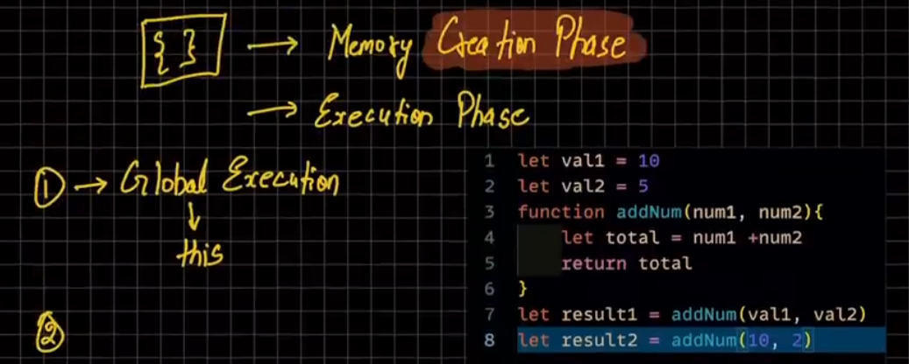
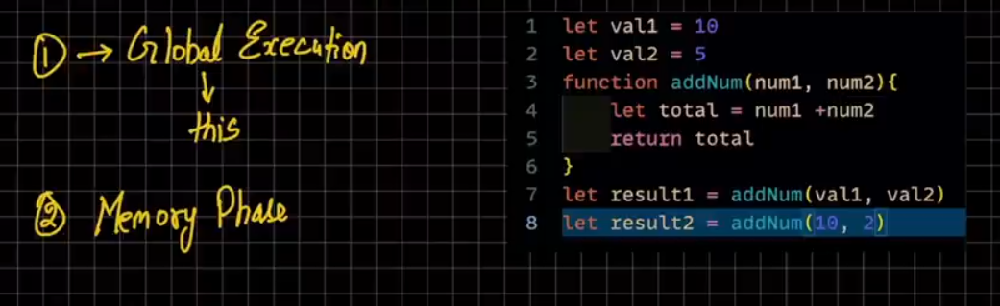
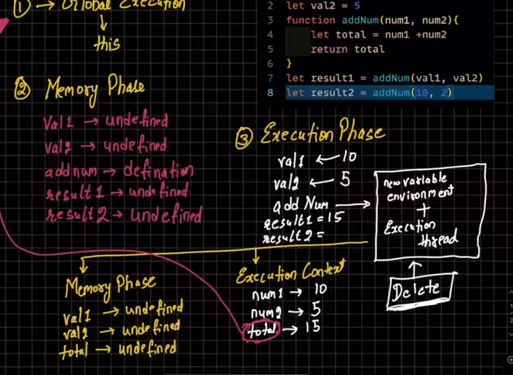
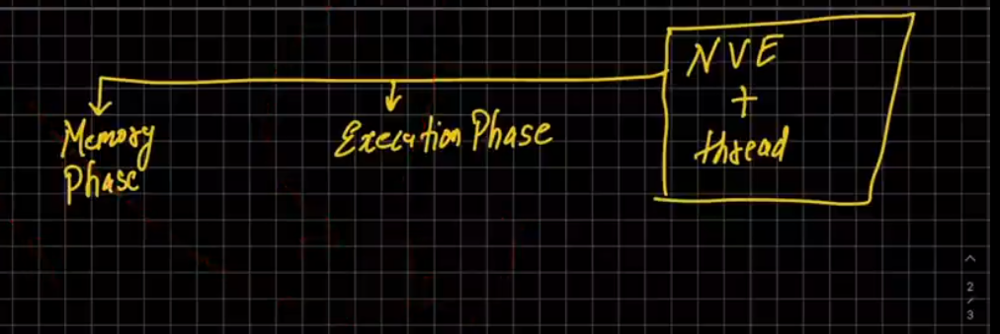

# js execution context

### (i) global ec ko global variable this me rakha jata hai

### (ii)function execution context

### (iii)eval execution context

`memory creation phase`

`execution phase`

<!--  -->

`image 2-i`

`image 2-ii`

