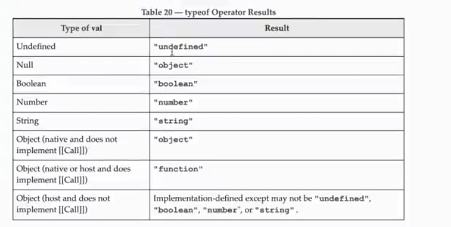

### This is the documention on js

```
dataTypes-Primitive
1>null -  ye empty value ko represent krta hai | standalone value
2>undefined- jab variable declare ho magar intialize na kya gaya ho yani value na di gai hoo
3>symbol=> unique
```

```
DataTypes-refernce
1> object
```

```
conversion
(1) "33" =>  33
(2)  "33abc" => NaN
(3)
(4)
```

## `Postfix` vs `Prefix`

### Postfix

```
The increment/decrement operation happens after the value is used.
```

Example:

```javascript
let x = 5;
console.log(x++); // 5
console.log(x); // 6
```

### Prefix

```
The increment/decrement operation happens before the value is used.
```

Example:

```javascript
let y = 5;
console.log(++y); // 6
console.log(y); // 6
```

# Comparison Details

This file contains various comparison operations and their results:

1. `console.log(2 > 2); // false`

   - Compares if 2 is greater than 2. The result is `false` because 2 is not greater than itself.

2. `console.log("2" > 1); // true`

   - Compares if the string "2" is greater than the number 1. JavaScript converts the string "2" to the number 2, and 2 is greater than 1, so the result is `true`.

3. `console.log(null > 0); // false`

   - Compares if `null` is greater than 0. The result is `false` because `null` is not greater than 0.

4. `console.log(null == 0); // false`

   - Compares if `null` is equal to 0. The result is `false` because `null` is not equal to 0.

5. `console.log(null >= 0); // true`
   - Compares if `null` is greater than or equal to 0. The result is `true` because `null` is considered equal to 0 in this comparison.

## Triple Equal (`===`)

The triple equal operator (`===`) is used to compare both the value and the type of two variables. It returns `true` only if both the value and the type are the same.

Examples:

1. `console.log(2 === 2); // true`

   - Both the value and the type (number) are the same.

2. `console.log(2 === "2"); // false`

   - The value is the same, but the type is different (number vs. string).

3. `console.log(null === null); // true`

   - Both the value and the type (object) are the same.

4. `console.log(undefined === undefined); // true`

   - Both the value and the type (undefined) are the same.

5. `console.log(true === 1); // false`
   - The value is different (true vs. 1) and the type is different (boolean vs. number).



## Memory Types

`There are two types of memory`

```
stack(primitive)
heap(non-primitive)
```

## String Methods

### Creating Strings

1. Using string literals:
   ````javascript
   const string = "hello world";
   ```st string = "hello world";
   ````
2. Using the `String` constructor:
   ```javascriptring` constructor:
   const string2 = new String("Hello world 2");
   ```st string2 = new String("Hello world 2");

   ```

### String Properties and Methods

### String Properties and Methods

- Accessing characters:
  ````javascriptracters:
  console.log(`string 1 is = ${string[4]} and string 2 is ${string2[2]}`);
  ```javascript
  console.log(`string 1 is = ${string[4]} and string 2 is ${string2[2]}`);
  ````
- Getting the length of a string:
  ```javascript
  console.log(string.length);ing:
  ```
  ```javascript

  ```
- Getting a character at a specific index:

  ````javascript
  console.log(string.charAt(2)); // returns 'l'
  ```ting a character at a specific index:

  ````

- Finding the index of a character:
  ```javascripttring.charAt(2)); // returns 'l'
  console.log(string.indexOf("l")); // returns 2
  ```
- Finding the index of a character:
- Extracting a substring:
  ```javascript
  const newString = string.substring(6, 11); // returns 'world'
  console.log(newString);
  ```
- Extracting a substring:
- Slicing a string:

  ```javascript
  const newString = string.slice(6, 11); // returns 'world'rld'
  console.log(newString);
  ```

- Trimming whitespace:
  ````javascript
  console.log(string.trim());
  ```st newString = string.slice(6, 11); // returns 'world'
  console.log(newString);
  ````
- Replacing a substring:
  ````javascript
  const name = "Haider-bhatti-h-h-h-h-h-h-h-h-h-h-h-hah";
  const cname = name.replace("bhatti", "Siddique"); // replaces 'bhatti' with 'Siddique'
  ```javascript
  console.log(string.trim());
  ````
- Checking if a string includes a substring:
  ```javascript
  const test = string.includes("bhatti"); // returns false
  ```
  ```javascript

  ```
- Displaying a string in a large font:h-h-h-h-h-h-h-hah";
  ```javascript name.replace("bhatti", "Siddique"); // replaces 'bhatti' with 'Siddique'
  console.log(name.big());
  ```
- Checking if a string includes a substring:

## Additional Details from `comparison.js`

````javascript
- Commented out comparisons:es("bhatti"); // returns false
```javascript
// console.log(2 > 2); // false
// console.log("2" > 1); // trueont:
// console.log(null > 0); // false
// console.log(null = 0); // false
// console.log(null >= 0); // true
````

## Additional Details from `comparison.js`

- Memory types:
  ````javascript comparisons:
  // stack(primitive)
  // heap(non-primitive)
  ```console.log(2 > 2); // false
  // console.log("2" > 1); // true
  ````
- String concatenation methods:false

  ````javascriptg(null = 0); // false
  // const value = "latest"; // true
  // console.log(name + repoCount + " Hello"); // old method
  // console.log(`this is a new method ${value}`); // modern method
  ```ory types:

  ````

- String creation methods:
  ```javascriptitive)
  // const string = "hello world              "; // using string literal
  // const string2 = new String("Hello world 2"); // using String constructor
  ```
- String concatenation methods:
- String methods:

  ```javascript
  // console.log(`string 1 is = ${string[4]} and string 2 is ${string2[2]}`); // accessing characters
  // console.log(string.__proto__); // accessing prototypeod
  // console.log(string.length); // getting length // modern method
  // console.log(string.charAt(2)); // getting character at index 2
  // console.log(string.indexOf("l")); // finding index of character 'l'
  // const newString = string.substring(6, 11); // extracting substring 'world'
  // console.log(newString); // printing substring
  // const newString = string.slice(6, 11); // slicing string to get 'world'
  // console.log(newString); // printing sliced stringing string literal
  // console.log(string.trim()); // trimming whitespaceing String constructor
  ```

- String replacement and inclusion:

  ````javascript
  // const name = "Haider-bhatti-h-h-h-h-h-h-h-h-h-h-h-hah";
  // const cname = name.replace("bhatti", "Siddique"); // replacing 'bhatti' with 'Siddique'haracters
  // const test = string.includes("bhatti"); // checking if 'bhatti' is included
  // console.log(name.big()); // displaying string in large font
  ```console.log(string.charAt(2)); // getting character at index 2
  // console.log(string.indexOf("l")); // finding index of character 'l'


  ```  console.log(typeof null); // 'object'  ```javascript- Checking types:  ```  // parseInt, parseFloat  ```javascript- Parsing integers and floats:### Parsing  ```  // Array, objects, functions  ```javascript- Reference data types:  ```  // string, number, boolean, null, undefined, symbol, BigInt  ```javascript- Primitive data types:### Data Types  ```  console.log(1 + 2 + "2"); // '32'  console.log("1" + 2 + 2); // '122'  console.log("1" + 2); // '12'  console.log(1 + "2"); // '12'  ```javascript- String and number operations:### Operations  ```  console.log(value2); // true  let value2 = Boolean(isLoggenin);  let isLoggenin = 1; // true  ```javascript- Converting values to booleans:  ```  let value = Number(score); // converts string to number  let score = "33";  ```javascript- Converting strings to numbers:### Converting Values## Conversion Operations  ```  console.log(newDate2); // fully customized date  const newDate2 = new Date().toLocaleString("default", { weekday: "long" });  console.log(newDate2.getDay()); // gets day of the week (0-based)  console.log(newDate.getMonth()); // gets month (0-based)  const newDate = new Date();  ```javascript- More date methods:  ```  console.log(tmstmp1); // current timestamp  const tmstmp1 = Date.now();  ```javascript- Getting timestamps:  ```  console.log(Math.floor(Date.now() / 1000)); // gets current time in seconds  console.log(specDates2.getTime()); // gets time in milliseconds  const specDates2 = new Date("01-23-2006"); // month starts from 1  const specDates = new Date(2006, 4, 23, 12, 1); // month starts from 0  ```javascript- Creating specific dates:  ```  console.log(mydate.toLocaleTimeString()); // converts date to locale time string  console.log(mydate.toLocaleString()); // converts date to locale string  console.log(mydate.toJSON()); // converts date to JSON string  console.log(mydate.toDateString()); // converts date to string  console.log(mydate.toString()); // converts date to string  let mydate = new Date();  ```javascript- Using the `Date` constructor:### Creating Dates## Date Methods  ```  console.log(Math.floor(Math.random() * (max - min + 1)) + min); // random number between 10 and 20  const max = 20;  const min = 10;  ```javascript- Generating random numbers within a range:  ```  console.log(Math.random() * 10 + 1); // random number between 1 and 11  console.log(Math.random()); // random number between 0 and 1  ```javascript- Generating random numbers:  ```  console.log(Math.max(...arr)); // 67  console.log(Math.min(...arr)); // 1  const arr = [29, 24, 45, 67, 23, 1, 2];  ```javascript- Finding min and max values:  ```  console.log(Math.round(4.73)); // 5  console.log(Math.ceil(3.1)); // 4  console.log(Math.floor(4.345)); // 4  ```javascript- Rounding numbers:  ```  console.log(Math.abs(-4)); // 4  ```javascript- Absolute value:### Math Methods  ```  console.log(1000000000000.toLocaleString("en-CA")); // '1,000,000,000,000'  console.log(score2.toPrecision(4)); // '451.5'  console.log(score2.toFixed(1)); // '451.5'  ```javascript- Formatting numbers:  ```  console.log(score2.toString().length); // 3  ```javascript- Converting numbers to strings:  ```  console.log(typeof score2); // 'object'  console.log(typeof score); // 'number'  const score2 = new Number(451.538683); // creates a number object  const score = 451;  ```javascript- Creating numbers:### Number Methods## Number and Math Methods  ```  console.log(arr); // remaining elements after splice  console.log(arr.splice(0, 2)); // removes elements from array and modifies original  console.log(arr.slice(2, 8)); // slices array without modifying original  console.log(arr.join()); // converts array to string  console.log(arr.indexOf("world")); // 1  console.log(arr.includes("world")); // true  const arr = ["hello", "world", "this", "is", "basic", "array", "manipulation", "and", "testing", "ok"];  ```javascript- Array manipulation methods:  ```  // Deep copy: properties do not share the same reference  // Shallow copy: properties share the same reference  ```javascript- Shallow and deep copy:  ```  console.log(Array.of(value1, value2, value3)); // creates array from values  let value3 = 300;  let value2 = 200;  let value1 = 100;  ```javascript- Creating arrays from values:  ```  console.log(Array.from({ name: "haider" })); // cannot convert object to array  console.log(Array.from("Haider")); // converts string to array  ```javascript- Converting values to arrays:  ```  console.log(Array.isArray(result)); // checks if result is an array  const result = anotherArray.flat(Infinity); // flattens array to any depth  const anotherArray = [1, 2, 3, [4, 5, 6], 7, [6, 7, [4, 5]]];  ```javascript- Flattening arrays:  ```  console.log(newHeros);  const newHeros = [...marvel, ...dc]; // merges elements using spread operator  ```javascript- Using the spread operator:  ```  console.log(newHero);  const newHero = marvel.concat(dc); // merges elements of marvel and dc arrays  ```javascript- Concatenating arrays:  ```  console.log(marvel[3][1]); // outputs 'Flash'  marvel.push(dc); // adds dc array to the end of marvel array (not recommended)  ```javascript- Pushing and popping elements:### Array Methods   ```   const arr2 = new Array(1, 2, 3, 4);   ```javascript2. Using the `Array` constructor:   ```   const dc = ["superman", "Flash", "cyborg"];   const marvel = ["Thor", "Hulk", "Dr.Strange"];   ```javascript1. Using array literals:### Creating Arrays## Array Methods  // const newString = string.substring(6, 11); // extracting substring 'world'
  // console.log(newString); // printing substring
  // const newString = string.slice(6, 11); // slicing string to get 'world'
  // console.log(newString); // printing sliced string
  // console.log(string.trim()); // trimming whitespace
  ````

- String replacement and inclusion:
  ```javascript
  // const name = "Haider-bhatti-h-h-h-h-h-h-h-h-h-h-h-hah";
  // const cname = name.replace("bhatti", "Siddique"); // replacing 'bhatti' with 'Siddique'
  // const test = string.includes("bhatti"); // checking if 'bhatti' is included
  // console.log(name.big()); // displaying string in large font
  ```
